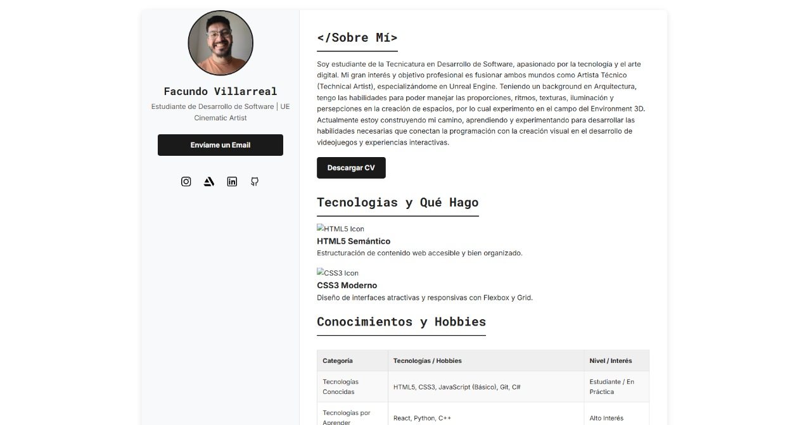

# Portfolio Personal - Práctica Formativa Front-End

Este proyecto es mi portfolio personal desarrollado como parte de la **Práctica Formativa N°2: "Mejorando nuestro portfolio con CSS"** para la materia de Front-End de la Tecnicatura en Desarrollo de Software.

El objetivo principal es aplicar y demostrar los conocimientos adquiridos en maquetación web semántica, estilización avanzada con CSS3 (incluyendo Flexbox, variables CSS, y diseño responsivo), y buenas prácticas de desarrollo front-end.

<!--
## 🚀 Demo en Vivo

Puedes ver una demostración en vivo del portfolio desplegada en GitHub Pages aquí:
[https://tu-usuario-github.github.io/PortfolioFrontEnd_TDS/](https://tu-usuario-github.github.io/PortfolioFrontEnd_TDS/)
-->
## ✨ Características Principales

*   **Diseño Responsivo:** Adaptable a múltiples tamaños de pantalla (desktop, tabletas y móviles) utilizando Media Queries.
*   **Estructura Semántica HTML5:** Uso correcto de etiquetas para mejorar la accesibilidad y el SEO.
*   **CSS3 Moderno:**
    *   Uso extensivo de Flexbox para layouts flexibles.
    *   Variables CSS (Custom Properties) para un tema consistente y fácil de mantener.
    *   Estilos para interactividad (estados hover, active).
    *   Organización modular y comentada del CSS.
*   **Secciones Detalladas:**
    *   **Sobre Mí:** Presentación personal y objetivos.
    *   **Habilidades Técnicas:** Listado categorizado de tecnologías y herramientas con iconos visuales.
    *   **Información Adicional:** Idiomas e intereses relevantes.
    *   **Contacto:** Formulario funcional integrado con Formspree.
*   **Código Limpio y Comentado:** Siguiendo las directrices de la práctica formativa.

## 🛠️ Tecnologías Utilizadas

*   **HTML5:** Para la estructura y contenido.
*   **CSS3:** Para el diseño y la presentación visual.
    *   Flexbox
    *   Variables CSS
    *   Media Queries
*   **JavaScript (Vanilla):** Para funcionalidades menores (ej. actualización dinámica del año en el footer).
*   **Formspree:** Para la gestión del formulario de contacto.
*   **Git y GitHub:** Para el control de versiones y alojamiento del código.
*   **GitHub Pages:** Para el despliegue del sitio.

## 📂 Estructura del Proyecto

`PortfolioFrontEnd_TDS/
├── assets/
│ ├── docs/
│ │ └── CV_Facundo_Villarreal.pdf (Ejemplo de CV)
│ └── img/
│ ├── profileImg.jpg
│ ├── html-svgrepo-com.svg
│ ├── css-svgrepo-com.svg
│ └── ... (otros iconos e imágenes)
├── css/
│ └── style.css
├── index.html
└── README.md`

## 📝 Mejoras y Cumplimiento de Consignas

Este proyecto busca cumplir con todos los requisitos de la Práctica Formativa 2, incluyendo:
*   Mejora de contenido y estructura del portfolio.
*   Aplicación avanzada de estilos CSS (box model, unidades relativas, pseudoclases, etc.).
*   Implementación de diseño responsivo para 4 breakpoints específicos.
*   Organización y comentarios del código.
*   Uso de iconos y manejo de fuentes personalizadas.

---

*¡Cualquier feedback es bienvenido!*